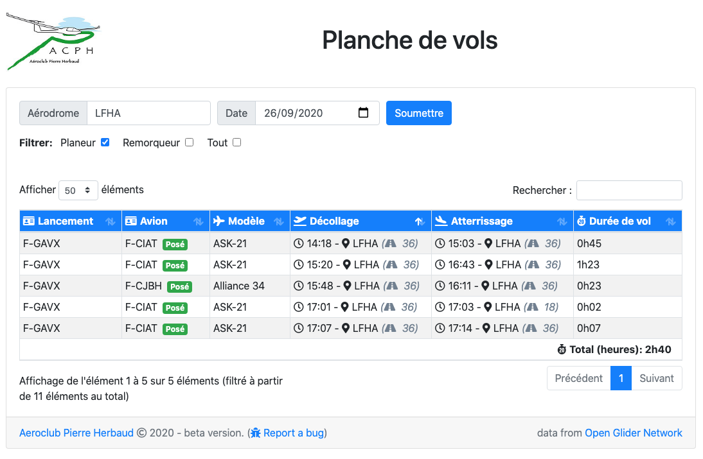

 

# PyAcphFlightsLogbook

Flight logbook for **glider** written in Python that automates detection of takeoff and landing events (airfield and schedule) by processing the APRS traffic from the [Open Glider Network](http://wiki.glidernet.org/).
As the program tracks events at aircraft level it can detect landing and takefoff on different airfields. The detected takeoff and landing times are approximate only. The accuracy is around 1 or 2 minutes.

This is a work in progress. Currently, in addition to takoff and landing events, the tool detects the launch method (aerotowing, self-launching or winch launching) and in the case of a towing, identifies the tow plane. It calculates also the flight duration.

Main features:

* Detection of takeoff and landing time
* Flight duration calculation
* Launch method (tow plane, winch or autonome) detection
* Identification of the tow plane
* Detection of the runway used for takeoff & landing

Futur releases could have additional features :

* Outlanding detection and location
* REST APIs to get logbook by icao, by aircraft id, by date range,...
* ...

## Usage

Executing the logbook python program is straight forward. It supports 2 arguments that are optionals. For the prerequisites before launching the program see the [installation](#installation) section

``` bash
# execute the tool with default config file ./acph-logbook.ini
python3 acph-logbook.py

# or with a specific config file
python3 acph-logbook.py -i path-to-my-config-file.ini
```

Example to get the help

``` bash
# get the help
python3 acph-logbook.py -h

#this will return the following output
usage: acph-logbook.py [-h] [-i CONFIG_FILE]

ACPH Glider flight logbook daemon

optional arguments:
  -h, --help            show this help message and exit
  -i CONFIG_FILE, --ini CONFIG_FILE path to the ini config file, default value is ./acph-logbook.ini
```

## Online demo

The program doesn't provide any APIs or front-end right now, but you can have a look to the implementation we did at [ACPH](https://aeroclub-issoire.fr) with a specific front-end develop for our website. There is also a REST API available to retreive logbook for a specific date & airfield. To date processing of APRS aircraft beacons are limited to 200km around LFHA, so there is a chance that you don't see any data for your airport. :confused:

* [Responsive web front-end](https://aeroclub-issoire.fr/wp-content/themes/zerif-lite-acph/acph-logbook.html)
* [REST API (example to get the LFHA logbook on August 29th, 2020)](https://aeroclub-issoire.fr/wp-json/acph/v1/logbook/2020-08-29/LFHA)



### ACPH REST API endpoints reference

| Resource | Base route | Prefered method | Description
| --- | --- | --- | ---|
| `logbook/<date>/<icao>` | `./wp-json/acph/v1` | GET | Retreive the logbook of the day `date` for the airfield identified by it's `icao` code.

``` bash
# Example: retreive the logbook for LFHA on August 29th, 2020
curl https://aeroclub-issoire.fr/wp-json/acph/v1/logbook/2020-08-29/LFHA
```

## Configuration

The program uses a configuration file to initalize settings related to database connection, logging behavior, APRS connection & filtering and other general settings.

The section `[logbook_general]` is used to initialize general parameters for the logbook

``` ini
[logbook]
; OGN devices database source: could be local or remote
ognddb = local
; Airport codes database source: could be local or remote
acdb = local
; persistence could be MySQL or JSON
persistence = MySQL
; number of days we keep logbook entry in the database
purge = 30
```

The section `[aprs]` is used to initialize  parameters related to APRS serveur connection and APRS messages filtering

``` ini
[aprs]
user = <aprs user>
passcode = <aprs passcode>
# any valid APRS filter like r/45.5138/3.2661/200, see http://www.aprs-is.net/javAPRSFilter.aspx
filter = <aprs filter>
```

The section `[mysql_connector_python]` is used to initialize parameters for database connection

``` ini
[mysql_connector_python]
database = <database-name>
user = <user>
password = <password>
host = <ip adress or dns name>
```

Sections for logging configuration are the standard ones of python logger package (see [logging.config](https://docs.python.org/3/library/logging.config.html) python documentation for more information). The default configuration logs messages up to INFO level in the log file `./logs/acph-aprs.log'` and message up to WARNING level on a slack channel (using webhook Slack API).

``` ini
...
[handlers]
keys=fileHandler,slackHandler

[handler_fileHandler]
class=FileHandler
level=INFO
formatter=acphFormatter
args=('./logs/acph-aprs.log',)

[handler_slackHandler]
class=slack_logger.SlackHandler
level=WARNING
formatter=acphSlackFormatter
args=('Put your webhook URL here',)
...
```

## Installation

The program requires Python 3. It has been developed and test only with Python 3.8.5 and Python 3.7.3

``` bash
# To know your python 3 version
python3 -V
```

### Download & install python dependencies

The logbook python program requires the following python packages. These packages have to be accessible through PYTHONPATH.

* geographiclib v1.50
* geopy v2.0.0
* mysql-connector-python v8.0.21
* ogn-client v0.9.7
* pid v3.0.4
* slack-logger v0.3.1

The best option it's to install them using pip. As for example:

```bash
pip3 install geopy
```

### Setup the MySql database

By default the program use a MySql database to store the results. Assuming you have already a MySql database running, run the script ```setup_db.py``` to initialize the required tables. This need to be done only once when the database structure evolved or to create tables. The script uses ```acph-logbook.ini``` configuration file to get database connection parameters

```bash
python3 ./setup_db.py
```

## Working principles

* process in realtime OGN APRS messages
* for each aircraft detect events like takeoff and landing and store them in a database
* keep x days of retention in the database
* rely on the following open data resources
  * The [OGN devices database](http://ddb.glidernet.org/) from [OpenGliderNetwork](http://wiki.glidernet.org/) to identify any FLARM/OGN-equiped aircraft (type, model,...)
  * The [Airport codes & runway  database](https://ourairports.com/data/) from [OurAirports](https://ourairports.com/) to identify takeoff and landing airfields

## Contributing

> Pending: :confused: to do!
